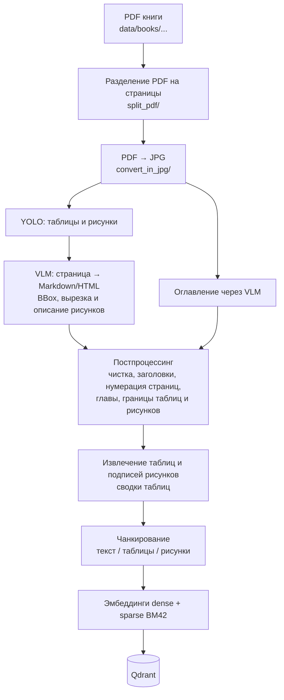

# Book Parsing RAG Indexer

Конвейер подготовки данных для RAG по сложным старым учебникам (сканы с таблицами,
рисунками, формулами): **PDF → страницы → JPG → YOLO → распознавание страниц VLM →
постобработка → чанки → векторная БД Qdrant (dense + sparse)**.

Репозиторий содержит только часть «парсинг и индексация». **Поиск, генерация ответов,
чат и оценка качества в репозиторий не входят**: на выходе получается заполненная
коллекция Qdrant, с которой можно работать любым своим retrieval-слоем.

## Что делает проект

1. Режет PDF книги на постраничные файлы и конвертирует их в JPG.
2. Через VLM (OpenAI-совместимый API) извлекает оглавление.
3. Детектирует таблицы и рисунки на страницах моделью YOLO (обученные веса лежат в `models/`).
4. Распознаёт каждую страницу VLM в Markdown/HTML: текст, таблицы (HTML с `colspan`/`rowspan`),
   вырезает рисунки по BBox и описывает их.
5. Постобрабатывает результат: чистит артефакты VLM, выравнивает уровни заголовков по оглавлению,
   нумерует страницы, собирает файлы в главы, нормализует границы таблиц и рисунков
   (в том числе таблицы, разорванные между страницами), выделяет таблицы и подписи к рисункам,
   строит сводки таблиц (структурные и через LLM).
6. Делит текст на чанки с метаданными (заголовки, страницы, книга, тип чанка) и отдельно
   формирует чанки таблиц и рисунков.
7. Считает dense-эмбеддинги и sparse-эмбеддинги (BM42) и загружает точки в Qdrant.

Отдельная ветка: парсинг научных PDF-статей через Docling (локально или через удалённый
сервер `server/docling_server.py`) и поиск/скачивание статей с arXiv.

## Схема этапов



Каждая книга лежит в своей папке `data/books/<Автор, Название>/`; этапы кладут результаты
в подпапки внутри неё (`split_pdf/`, `convert_in_jpg/`, `parsed/`, `chapters/`, `chunks/` и т. д.,
точные имена см. в `src/run_*.py`).

## Соответствие этапов страницам Streamlit и модулям

Модули `src/run_*.py` не имеют собственного CLI (`argparse`): это функции-оркестраторы,
которые вызываются со страниц Streamlit (с поддержкой отмены и прогресса) и могут быть
импортированы из своих скриптов. Основной способ запуска - Streamlit.

| Этап | Страница Streamlit | Модуль / функция |
|------|--------------------|------------------|
| Разделение PDF на страницы | `3_preprocessing` - вкладка разделения | `src/run_pdf_split.py::run_pdf_split` |
| PDF → JPG | `3_preprocessing` | `src/run_pdf_to_jpg.py::run_pdf_to_jpg` |
| Оглавление (VLM) | `3_preprocessing` | `src/run_extract_toc.py::run_extract_toc` |
| YOLO-детекция таблиц/рисунков | `4_parsing` - вкладка YOLO (и визуальный обзор) | `src/run_yolo_detector.py::run_yolo_detection` |
| Распознавание страниц VLM (шаги 1-3: текст, BBox, описания рисунков) | `4_parsing` | `src/run_page_parser.py::run_page_parser`, `run_step1_only`, `run_step2_only`, `run_step3_only` |
| Очистка артефактов VLM | `5_postprocessing` | `src/run_clean_table_headers.py` |
| Выравнивание заголовков по оглавлению | `5_postprocessing` | `src/run_fix_heading_levels.py` |
| Нумерация страниц (`<N>` перед абзацами) | `5_postprocessing` | `src/run_page_numbering.py` |
| Склейка по главам | `5_postprocessing` | `src/run_chapter_merger.py` |
| Нормализация границ таблиц / рисунков | `5_postprocessing` | `src/run_normalize_tables.py`, `src/run_normalize_figures.py` |
| Извлечение таблиц / подписей рисунков | `5_postprocessing` | `src/run_extract_tables_md.py`, `src/run_extract_figure_captions.py` |
| Очистка по маркерам | `5_postprocessing` | `src/run_clean_tagged.py` |
| Сводки таблиц (структурные, LLM) | `5_postprocessing` | `src/run_table_summary.py`, `src/run_llm_table_summary.py` |
| Проверка размеров чанков | `5_postprocessing` | `src/check_chunk_sizes.py` |
| Чанкирование, библиография книг | `5_postprocessing` | `src/run_chunking.py`, `src/book_metadata.py` |
| Векторизация текста / таблиц / рисунков, коллекции, снапшоты, модели эмбеддингов | `6_vectorizer` | `src/run_vectorizer.py`, `src/vectorizer.py`, `src/qdrant_snapshots.py` |
| Парсинг статей (Docling) | `2_Article_Parsing` | `src/run_docling_parser.py::run_article_parsing` |
| Поиск и загрузка статей arXiv | `1_downloader` | `src/arxiv_searcher.py`, `src/arxiv_downloader.py` |
| Редактор промптов, реестр моделей | `7_prompts`, `4_parsing` (вкладка моделей) | `src/prompts.py`, `src/llm_clients.py` |

Пример вызова без интерфейса (сигнатуры взяты из кода; перед запуском поправьте параметры):

```python
from pathlib import Path
from src.run_pdf_to_jpg import run_pdf_to_jpg
from src.run_yolo_detector import run_yolo_detection

base = Path("data/books")
run_pdf_to_jpg(base_dir=base, book_names=["Автор, Название"], dpi=200)
run_yolo_detection(base_dir=base, model_path="models/yolo/book_parsing_n/weights/best.pt",
                   book_name="Автор, Название")
```

## Установка

Требуется **Python 3.11-3.12** и системная зависимость **poppler** (нужна `pdf2image`):

```bash
# Debian/Ubuntu
sudo apt install poppler-utils
# macOS
brew install poppler
# Windows: скачайте poppler и укажите путь в поле poppler_path на странице препроцессинга

python -m venv .venv && source .venv/bin/activate
pip install -r requirements.txt
```

Версии зависимостей в `requirements.txt` намеренно не зафиксированы (в проекте они не
пинились). Для воспроизводимости зафиксируйте их у себя через `pip freeze`.

### Ключи и настройки

```bash
cp .env.example .env                                     # затем заполните значения
# или
cp .streamlit/secrets.toml.example .streamlit/secrets.toml
```

Приоритет: `secrets.toml` > `.env` > переменные окружения. Файлы с секретами в `.gitignore`.
Ключи нужны только для тех провайдеров, которыми вы пользуетесь: `NEUROAPI_API_KEY`
(OpenAI-совместимый шлюз для VLM/LLM), `GLM_API_KEY`, `GIGACHAT_*`, `YANDEX_DISK_TOKEN`
(если файлы лежат на Яндекс.Диске), `HF_TOKEN` (скачивание моделей эмбеддингов),
`QDRANT_HOST`/`QDRANT_PORT`, `ARXIV_EMAIL` (для User-Agent при обращении к arXiv).

### Qdrant

```bash
docker compose up -d        # REST: 6333, gRPC: 6334, данные в data/vector_db/
```

### Streamlit

```bash
streamlit run main.py
```

Положите свой PDF в `data/books/<Автор, Название>/` (или укажите исходную папку на странице
препроцессинга) и идите по страницам слева направо. Порядок вкладок на странице
постпроцессинга не равен порядку зависимостей между этапами и жёстко не проверяется: например,
выравнивание заголовков требует готового оглавления, а склейка по главам - предварительной
нумерации страниц.

### Тесты

```bash
pytest
```

Тесты покрывают только чистые функции без API и сети (`normalize_tables`, `chunking`,
`table_refs`, `page_numbering`, `clean_table_headers`).

## Данные

**Сканы учебников в репозиторий не включены из-за авторских прав.** Каталог `data/` содержит
лишь пустые папки с `.gitkeep`. Пример: положите свой PDF в
`data/books/Автор, Название/Автор, Название.pdf`. Имя папки вида `Автор, Название`
используется для метаданных чанков (`parse_book_name`).

В `models/yolo/book_parsing_n/` лежат веса детектора (`weights/best.pt`), параметры обучения
(`args.yaml`), `results.csv` и графики обучения без изображений страниц. Обучающая выборка в репозиторий не входит.

## Структура репозитория

```
main.py                     дашборд, статус Qdrant
pages/                      страницы Streamlit (1_downloader ... 7_prompts)
src/                        логика этапов, run_*.py - оркестраторы
  vectorizer.py             эмбеддинги dense/sparse, коллекции Qdrant, загрузка точек
  run_vectorizer.py         векторизация текста, таблиц, рисунков
server/                     Docling-сервер (FastAPI) и ноутбук для Colab
models/yolo/                веса и графики обучения YOLO
tests/                      pytest для чистых функций
docs/screenshots/           скриншоты интерфейса
data/                       книги, статьи, векторная БД (локально, не в git)
docker-compose.yml          Qdrant
```

## Скриншоты

TODO: добавить скриншоты интерфейса.

- `docs/screenshots/preprocessing.png` - препроцессинг
- `docs/screenshots/yolo_visual.png` - визуальный обзор YOLO-результатов
- `docs/screenshots/postprocessing.png` - постпроцессинг
- `docs/screenshots/vectorizer.png` - векторизация и коллекции Qdrant

## Трудности и решения

- **Таблицы, разорванные между страницами.** VLM видит одну страницу и не знает про продолжение.
  Границы таблиц определяются по подписям («Таблица N», «Продолжение таблицы»), после чего
  части одной таблицы объединяются в один блок с маркерами `[TABLE_START]`/`[TABLE_END]`
  (`normalize_tables.py`). Эвристики не идеальны, результат нужно проверять глазами.
- **Объединённые ячейки.** Таблицы хранятся как HTML с `colspan`/`rowspan`, потому что Markdown
  их не выражает; для текстового чанка строится отдельная структурная сводка.
- **Слабые модели путают числа в таблицах.** Поэтому таблицы выносятся в отдельные файлы,
  а для слишком больших делается LLM-сводка (`llm_table_summary.py`); качество зависит от
  выбранной модели, и это стоит проверять выборочно.
- **Частные случаи.** Разные книги ломаются по-разному (подписи рисунков, номера страниц,
  заголовки без `#`), поэтому постпроцессинг состоит из многих небольших отдельных скриптов
  вместо одного универсального.
- **Визуализация.** Результаты YOLO и разметки удобнее проверять глазами, поэтому часть
  интерфейса Streamlit - просмотр страниц с найденными областями и счётчики по каждому этапу.

## Лицензия

TODO: выбрать лицензию. Учтите, что `ultralytics` (YOLO) распространяется под AGPL-3.0.
